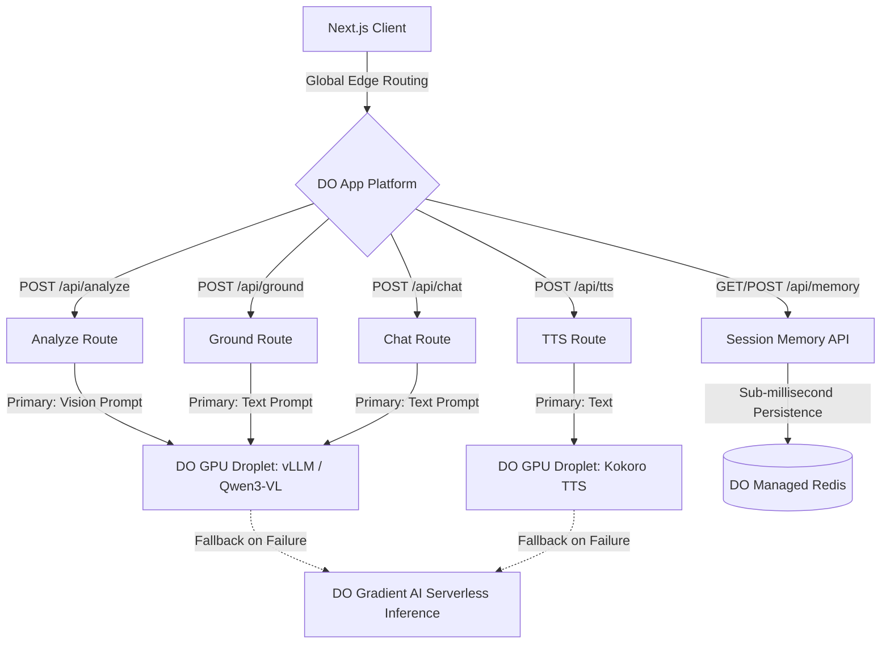

# 🌊 GradientLens: Powered by DigitalOcean

GradientLens is a real-time, multimodal assistive app for people with low vision. It combines live camera analysis, proactive safety cues, and voice interaction—all powered by the incredible speed, scale, and developer experience of the **DigitalOcean Cloud**.

[](https://cloud.digitalocean.com/apps/new?repo=https://github.com/lasse/gradient-lens/tree/main)

## 🏆 DigitalOcean Gradient AI Hackathon

This project was built from the ground up to showcase the power of the DigitalOcean ecosystem. We've created a hybrid, hyper-scalable architecture leveraging DO's best-in-class products:

🚀 **DigitalOcean App Platform**  
Seamless, zero-config global deployment for our Next.js frontend and API routes. Pushing to production is as simple as a `git push`.

🧠 **DigitalOcean Gradient AI (Serverless Inference)**  
Highly available, serverless LLM inference. We use Gradient AI as our **bulletproof fallback layer**: if our custom GPU Droplets ever experience downtime or latency spikes, the app seamlessly falls back to Gradient's Serverless Inference to ensure users never lose access to critical visual, chat, and grounding features.

⚡ **DigitalOcean Managed Databases (Redis/Valkey)**  
Highly available, fully managed Redis provides lightning-fast persistent session memory, allowing GradientLens to remember past interactions and user context securely.

🔥 **DigitalOcean GPU Droplets (H200, H100, L40S, RTX 6000 ADA, RTX 4000 ADA)**  
For custom, bleeding-edge open-source models! We provisioned raw DO GPU Droplets to host **Qwen3-VL-8B-Instruct** (via vLLM) for ultra-fast visual scene understanding, and **Kokoro TTS** for real-time, low-latency voice synthesis.

---

## 🏗️ Architecture: The DO Advantage



## ✨ Features

1. **Live Camera Scene Understanding:** Real-time grocery, document, medication, and environment modes powered by dedicated DO GPU Droplets.
2. **Highly Available Architecture (DO Fallback):** Code-level resilience ensures that if custom inference endpoints ever experience latency or downtime, the system automatically and instantly falls back to DigitalOcean Serverless Inference.
3. **Proactive Safety & Hazard Detection:** Low-latency inference ensures users get safety cues exactly when they need them.
4. **Conversational AI:** Grounded, context-aware voice sessions backed by Qwen3-VL on DO GPU Droplets.
5. **Instant Voice Responses:** High-speed GPU-accelerated text-to-speech (Kokoro) on DO Droplets.
6. **Persistent Context:** DO Managed Redis ensures user sessions and memory never drop.

## 💻 Local Setup & Development

Experience the DO developer magic locally:

1. Install dependencies: `npm ci`
2. Copy environment variables: `cp .env.example .env.local`
3. Add your **DO Gradient Model Access Key**: `DO_GRADIENT_MODEL_ACCESS_KEY`
4. Run the app: `npm run dev`
5. Test on mobile (requires HTTPS): `./scripts/tunnel.sh 3000`

## 🚀 Unleashing DO GPU Droplets (Custom Inference)

Take full control with DigitalOcean's powerful GPU Droplets. We provide one-click setup scripts to transform a raw DO GPU instance into a high-performance inference server:

1. **Vision Inference (vLLM)**: Run `./scripts/gpu-setup.sh` on an AI/ML-ready DO GPU Droplet to instantly deploy `Qwen3-VL-8B-Instruct`. This provides a massive throughput, OpenAI-compatible vision endpoint on port `8000`.
2. **Real-time TTS (Kokoro)**: Run `./scripts/tts-setup.sh` on a DO GPU Droplet to host Kokoro TTS via FastAPI for natural, ultra-fast speech synthesis on port `8880`.

Update your `.env.local` with your new Droplet IPs!

## ☁️ Automated Cloud Deployment to DO

DigitalOcean makes deployment beautifully simple. Use our helper script to validate and push directly to the DO App Platform:

> [!IMPORTANT]
> **Pro-Tip**: Create your Managed Database cluster **before** deploying the App Spec!
>
> ```bash
> # Spin up a highly available Redis cluster in ~5 minutes!
> doctl databases create gradient-lens-redis-cluster --engine valkey --region nyc3 --size db-s-1vcpu-1gb --num-nodes 1
> ```

Once your DO Redis cluster is ready, deploy the entire stack:
```bash
./scripts/deploy.sh --cloud [--region <region>]
```
Our script magically syncs your local `.env.local` model configurations and custom Droplet IPs straight into the DigitalOcean `app.yaml` spec.

## 🔐 Environment Variables

- `DO_GRADIENT_MODEL_ACCESS_KEY` (required): Your key to the Gradient AI kingdom.
- `DO_GRADIENT_BASE_URL` (optional): Defaults to `https://inference.do-ai.run`.
- `DO_GRADIENT_TEXT_MODEL` (optional): DO Text model ID (default: `llama3.3-70b-instruct`).
- `DO_GRADIENT_VISION_MODEL` (optional): DO Vision model ID (default: `openai-gpt-4o-mini` or your custom Droplet IP).
- `KOKORO_TTS_URL` (optional): Point this to your dedicated DO TTS Droplet!
- `REDIS_URL` (optional): Connection string for your blazing fast DO Managed Redis.
- `MEMORY_TTL_SECONDS` (optional): Session memory retention window.

## 🛠️ DO Utilities

- `./scripts/deploy.sh`: Validates and deploys to DO App Platform via `doctl`.
- `./scripts/gpu-setup.sh`: Turns a DO Droplet into a vLLM Vision Server.
- `./scripts/tts-setup.sh`: Turns a DO Droplet into a Kokoro TTS Server.

## License

MIT
