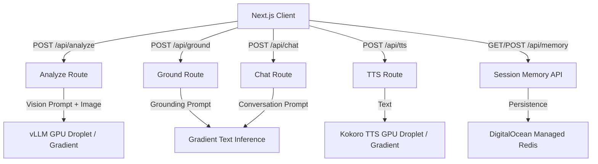

# GradientLens

GradientLens is a real-time, multimodal assistive app for people with low vision. It combines live camera analysis, proactive safety cues, and voice interaction, powered by DigitalOcean App Platform and custom GPU Droplets.

## Hackathon Alignment

This project is configured for the DigitalOcean Gradient AI Hackathon and uses a hybrid architecture of DigitalOcean serverless inference and dedicated GPU droplets.

1. Platform: DigitalOcean App Platform (Next.js frontend) and Droplets (GPU inference).
2. Auth: Model access key via `DO_GRADIENT_MODEL_ACCESS_KEY`.
3. Persistent Storage: DigitalOcean Managed Redis.

## Architecture



## Features

1. Live camera scene understanding for grocery, document, medication, and environment modes (powered by Qwen3-VL-8B-Instruct or GPT-4o-mini).
2. Proactive suggestions and hazard detection.
3. Voice session with browser speech recognition + high-speed GPU accelerated text-to-speech (Kokoro).
4. Document summarization and question answering.
5. Persistent session memory backed by **DigitalOcean Managed Redis**.

## Local Setup

1. Install dependencies with `npm ci`.
2. Copy `.env.example` to `.env.local`.
3. Configure your environment variables in `.env.local` (see below).
4. Run the app with `npm run dev`.
5. For mobile testing, expose your local server with `./scripts/tunnel.sh 3000`.
6. Run tests with `npm test`.

## GPU Droplet Infrastructure (Optional/Custom Inference)

We provide scripts to spin up your own GPU droplets for high-performance Vision and TTS capabilities.

1. **Vision Inference (vLLM)**: Run `./scripts/gpu-setup.sh` on an AI/ML-ready GPU Droplet to host `Qwen3-VL-8B-Instruct` via vLLM. This provides a fast, open-source vision endpoint on port `8000`.
2. **TTS (Kokoro)**: Run `./scripts/tts-setup.sh` on a GPU Droplet to host Kokoro TTS via FastAPI. This provides ultra-fast speech synthesis on port `8880`.

Update your `.env.local` with the endpoints provided by these scripts.

## Automated Cloud Deployment

[](https://cloud.digitalocean.com/apps/new?repo=https://github.com/lasse/gradient-lens/tree/main)

Alternatively, use the DigitalOcean CLI and our deployment helper.

> [!IMPORTANT]
> **Prerequisite**: You must create a Managed Database cluster **before** deploying the App Spec, as Redis/Valkey cannot be auto-provisioned within the spec.
>
> ```bash
> # Create the cluster (takes ~5 minutes)
> doctl databases create gradient-lens-redis-cluster --engine valkey --region nyc3 --size db-s-1vcpu-1gb --num-nodes 1
> ```

Once the cluster is ready, deploy the app:
```bash
./scripts/deploy.sh --cloud [--region <region>]
```
This script automatically syncs your model and TTS endpoints from `.env.local` to `app.yaml`.

## Environment Variables

- `DO_GRADIENT_MODEL_ACCESS_KEY` (required): DigitalOcean Gradient model access key.
- `DO_GRADIENT_BASE_URL` (optional): Defaults to `https://inference.do-ai.run` or your custom Droplet IP.
- `DO_GRADIENT_TEXT_MODEL` (optional): Text/chat model ID (default: `llama3.3-70b-instruct`).
- `DO_GRADIENT_VISION_MODEL` (optional): Vision-capable model ID (default: `openai-gpt-4o-mini`).
- `KOKORO_TTS_URL` (optional): TTS API endpoint (default uses Gradient, or set to your Kokoro Droplet IP).
- `REDIS_URL` (optional): Connection string for DigitalOcean Managed Redis.
- `MEMORY_TTL_SECONDS` (optional): Session memory retention window.

## Utilities

- `./scripts/deploy.sh`: Validates environment, builds the app, and optionally deploys to DigitalOcean App Platform.
- `./scripts/tunnel.sh`: Starts a secure tunnel (via localtunnel or ngrok) for testing on mobile devices.
- `./scripts/teardown.sh`: Cleans up local build artifacts (`.next` folder).

## License

MIT
