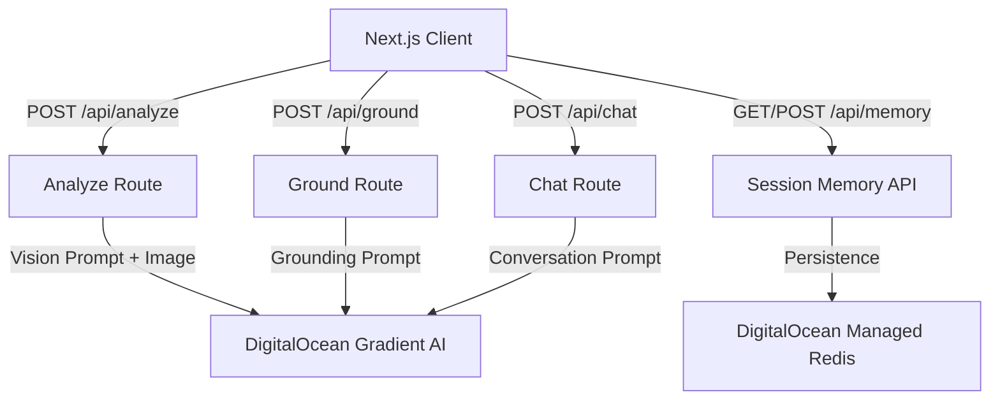

# GradientLens

GradientLens is a real-time, multimodal assistive app for people with low vision. It combines live camera analysis, proactive safety cues, and voice interaction, powered by DigitalOcean Gradient AI.

## Hackathon Alignment

This project is configured for the DigitalOcean Gradient AI Hackathon and uses DigitalOcean Gradient AI serverless inference as its model backend.

1. Platform: DigitalOcean Gradient AI (`https://inference.do-ai.run`).
2. Auth: Model access key via `DO_GRADIENT_MODEL_ACCESS_KEY`.
3. Build path: Next.js app deployable on DigitalOcean App Platform.

Resources:

1. https://digitalocean.devpost.com/resources
2. https://docs.digitalocean.com/products/gradient-ai-platform/
3. https://docs.digitalocean.com/products/gradient-ai-platform/how-to/use-serverless-inference/

## Architecture



## Features

1. Live camera scene understanding for grocery, document, medication, and environment modes.
2. Proactive suggestions and hazard detection.
3. Voice session with browser speech recognition + spoken assistant responses.
4. Document summarization and question answering.
5. Persistent session memory backed by **DigitalOcean Managed Redis**.

## Local Setup

1. Install dependencies with `npm ci`.
2. Copy `.env.example` to `.env.local`.
3. Add your DigitalOcean Gradient model access key in `DO_GRADIENT_MODEL_ACCESS_KEY`.
4. (Optional) Add your `REDIS_URL` for persistent session memory.
5. Run the app with `npm run dev`.
6. Run tests with `npm test`.

Run `./scripts/deploy.sh` to validate env and build output before deploying to DigitalOcean App Platform.

### Automated Cloud Deployment

[](https://cloud.digitalocean.com/apps/new?repo=https://github.com/lasse/gradient-lens/tree/main)

Alternatively, use the DigitalOcean CLI.

> [!IMPORTANT]
> **Prerequisite**: You must create a Managed Database cluster **before** deploying the App Spec, as Redis/Valkey cannot be auto-provisioned within the spec.
>
> ```bash
> # Create the cluster (takes ~5 minutes)
> doctl databases create gradient-lens-redis-cluster --engine valkey --region nyc1 --size db-s-1vcpu-1gb --num-nodes 1
> ```

Once the cluster is ready, deploy the app:
```bash
doctl apps create --spec app.yaml
```
or use the helper script:
```bash
./scripts/deploy.sh --cloud
```

## Environment Variables

1. `DO_GRADIENT_MODEL_ACCESS_KEY` (required): DigitalOcean Gradient model access key.
2. `DO_GRADIENT_BASE_URL` (optional): Defaults to `https://inference.do-ai.run`.
3. `DO_GRADIENT_TEXT_MODEL` (optional): Text/chat model ID.
4. `DO_GRADIENT_VISION_MODEL` (optional): Vision-capable model ID.
5. `REDIS_URL` (optional): Connection string for DigitalOcean Managed Redis.
6. `MEMORY_TTL_SECONDS` (optional): Session memory retention window.

## License

MIT
